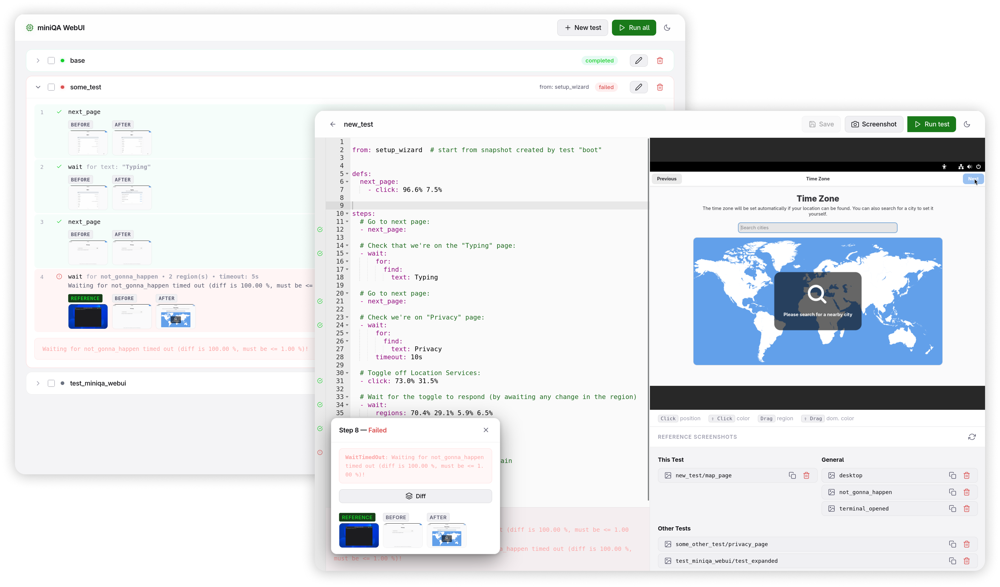

# miniQA

A simple to use automated QA test tool: miniQA runs an OS of your choice in QEMU, interacts with it based on your YAML test files and ensures the results match your criteria.

miniQA includes a simple web editor/mini IDE providing some helpful tools to write your test cases in quick iterations with the VM screen on the side.

[](docs/img/hero.png)

There's also a short [screencast](https://mityax.github.io/miniqa/img/miniqa_tour_screencast.mp4) showcasing a typical workflow (apologies for the typos).

## Setup

### Via PIP

miniQA can be installed via pip:

```bash
pip install miniqa  # - or: `pip install miniqa[ocr]` for text recognition support
```

Make sure you have the runtime dependencies (`qemu-system-x86`, `qemu-utils` and optionally `ovmf`) installed as well:

- Debian: `sudo apt install qemu-system-x86 qemu-utils ovmf`
- Fedora: `sudo dnf install qemu-system-x86 qemu-img edk2-ovmf`

To run your tests, invoke this from your tests folder:

```bash
miniqa run    # - or: `miniqa editor` for the webui
```

### Via Podman/Docker

Alternatively, miniQA can be used without any installation via podman or docker. The image includes QEMU already. To do so, just invoke a command such as this from your tests folder:

```bash
docker run \
    --rm \
    -it \
    --device /dev/kvm \
    --tmpfs /tmp:size=1G,mode=1700 \
    -p 8080:8080 \
    -p 6080:6080 \
    -v .:/tests \
    ghcr.io/mityax/miniqa run    # - or: `miniqa editor` for the webui
```

> Note that the default images include text recognition support; if you don't use that functionality, you
can use the `ghcr.io/mityax/miniqa:latest-no-ocr` image instead, which is just about half the size.

## Quick Start

### Setup the Files:

This is the directory structure we're going to need:

```
your_project
├── …
└── tests
    ├── img
    │   └── gnome_os_disk.img
    ├── tests
    │   ├── example_test.yml
    │   ├── second_example_test.yml
    │   └── …
    └── miniqa.yml
```

- The `img` folder: The OS image(s) will be located here. For example, you can grab a copy of
  [GNOME OS Nightly](https://os.gnome.org/) and place it in `img/gnome_os_disk.img`.
- The `miniqa.yml` file: This file contains your overall miniQA configuration and can look like this:

	```yaml
    image: img/gnome_os_disk.img                   # the image our VM boots

    use_ovmf: true                                 # required to boot GNOME OS
    qemu_args: [
      "-device", "virtio-multitouch-pci",          # adds multitouch capabilities to the VM
      "-device", "VGA,edid=on,xres=1080,yres=720"  # ensures a fixed screen resolution
    ]
    
    cache_directory: ./miniqa-cache
	```
- The nested `tests` folder: This will contain your test cases, e.g. 
  [`example_test.yml`](sample_tests/tests/base.yml), or this one:

    ```yaml
    steps:
      - wait:                                      # - wait for boot to complete, and then for the GNOME OS
          for:                                     #   setup wizard (which has gray background) to show up
            dominant_color: '#fafafb' 
          timeout: 120s                            # - on timeout, our test will fail
      - click:                                     # - go to the next page      
          find:
            text: Next
      - snapshot: base                             # - create a snapshot other tests can start from
    ```

### Run your Tests
Now, you're ready to run your first test:

```bash
cd your_project/tests
miniqa run
```

### Edit in the Webui

Afterward, you can edit your tests in any editor you like, but I'd highly recommend using miniQA's webui. 
This way you'll be able to

- run tests right away,
- see the VM's screen right next to the YAML editor, and
- have basic autocomplete making it easy to discover miniQA's features.

The webui also has tools allowing you to easily pick screen positions, regions and colors right from the VM.

To launch it, run:

```bash
miniqa editor
```

## Check the Docs

Well, docs might be a bit far-fetched, but there's a bit of reference in [./docs](./docs).

The aim is, that this should be enough to easily find your way into miniQA and work with it in the long run; should you have questions or miss anything in there, please don't hesitate to [create an issue](https://github.com/mityax/miniqa/issues/new) to get in touch.

## Contribute

I'd highly value your contributions – if you'd like to add a new feature or make bigger changes, please [create an issue](https://github.com/mityax/miniqa/issues/new) to briefly discuss it upfront, so we can make sure your work is not for nothing; for small fixes feel free to just open a PR.

Please be aware that the codebase is not yet quite as clean as I'd like it to be, since this project was originally just a sidequest and I haven't yet had much time to fully clean it up. However, I'm glad to help you around, should you have questions!

## Support

If miniQA is helpful for you, I'd appreciate you supporting me with a small amount. Even a dollar a month helps!

To donate, choose a platform below:

<a href='https://ko-fi.com/Q5Q41A9U4G' target='_blank'></a><br />
<i>Recommended! Most payment methods, one-time or recurring donations, no sign up required.</i>

<a href='https://buymeacoffee.com/mityax' target='_blank'></a><br />
<i>Donate by card, no sign up required.</i>


## License

This project is licensed under GPL-3.0-or-later.
